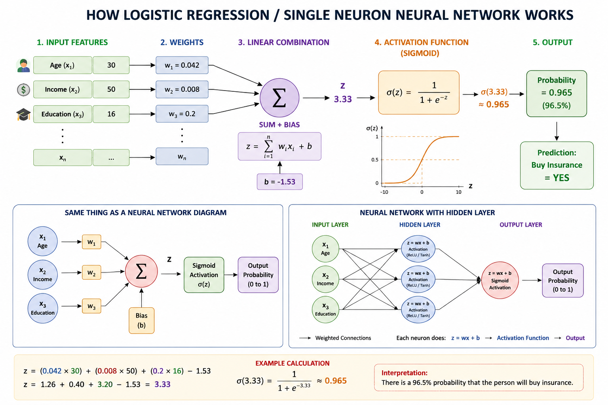

# Neural Networks & Sigmoid Function — Complete Notes

## Diagram

## 1. Introduction

A neural network is a computational model inspired by how the human brain processes information. It learns patterns from data by combining inputs, applying weights, and producing outputs through mathematical functions.

At the core of most simple neural models is a single idea:

> Inputs → Linear Calculation → Activation Function → Output

---

# 2. How a Neuron Works in a Neural Network

A single neuron performs two main operations:

### Step 1: Linear Combination

z = w1x1 + w2x2 + ... + wnxn + b

Where:
- xi = input features  
- wi = weights (importance of each feature)  
- b = bias (adjustment term)  
- z = raw score  

This is similar to:
y = mx + c

---

### Step 2: Activation Function

a = f(z)

Most commonly used activation:

sigma(z) = 1 / (1 + e^-z)

---

# 3. Sigmoid Function

## Definition

The **sigmoid function** is an activation function used in neural networks to convert any number into a value between **0 and 1**.

**Equation:**

\sigma(x)=\frac{1}{1+e^{-x}}

### Simple Explanation

* **x** = input value
* **e** ≈ 2.718 (a mathematical constant)
* **σ(x)** = output of the sigmoid function

### Examples

* If **x = 0**, output = **0.5**
* If **x = 10**, output ≈ **1**
* If **x = -10**, output ≈ **0**

### Why it is used

It acts like a probability:

* Output close to **1** → Yes / True
* Output close to **0** → No / False

### Shape

The sigmoid curve looks like an **S-shape**:

* Large negative input → near 0
* Input around 0 → around 0.5
* Large positive input → near 1

So, the sigmoid function takes any input and smoothly squeezes it into the range **0 to 1**.

# 4. Euler Number
e ≈ 2.71828

Used in exponential functions and sigmoid.

---

# 5. Activation Function
A function that decides how much information passes forward.

Without it, neural networks behave like linear models.

---

# 6. Logistic Regression vs Neural Network

Logistic Regression:
Input → Linear → Sigmoid → Output

Neural Network:
Input → Hidden Layers → Output

---

# 7. Why Linear + Sigmoid?

Linear gives score (z)
Sigmoid converts score into probability (0–1)

---

# 8. Example (Insurance Prediction)

z = 3.33
sigmoid(z) ≈ 0.965

Meaning: 96.5% probability

---

# 9. Final Concept

Inputs → Weighted Sum → Activation → Output

---

# 10. Interview Questions

Q: What is sigmoid?
A: S-shaped function converting values to 0–1 probability.

Q: What is activation function?
A: Function that introduces non-linearity.

Q: Is logistic regression a neural network?
A: Yes, simplest form (single neuron).

