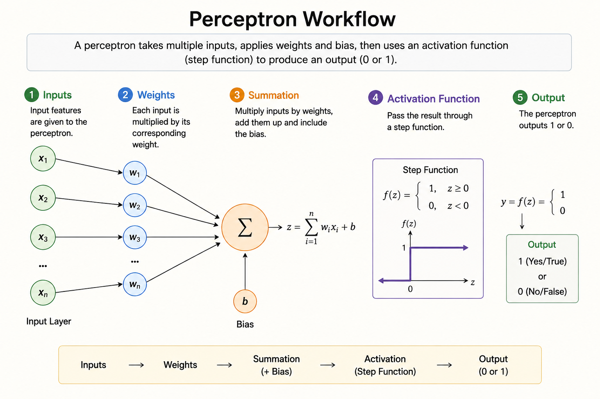
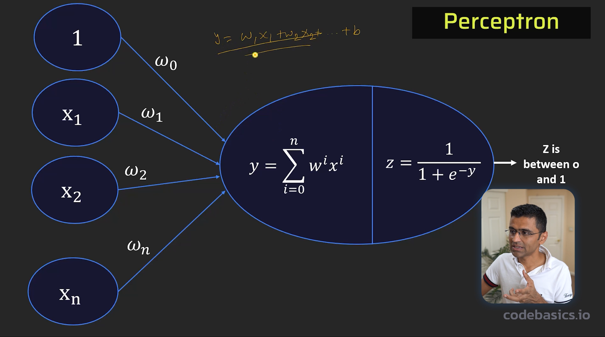
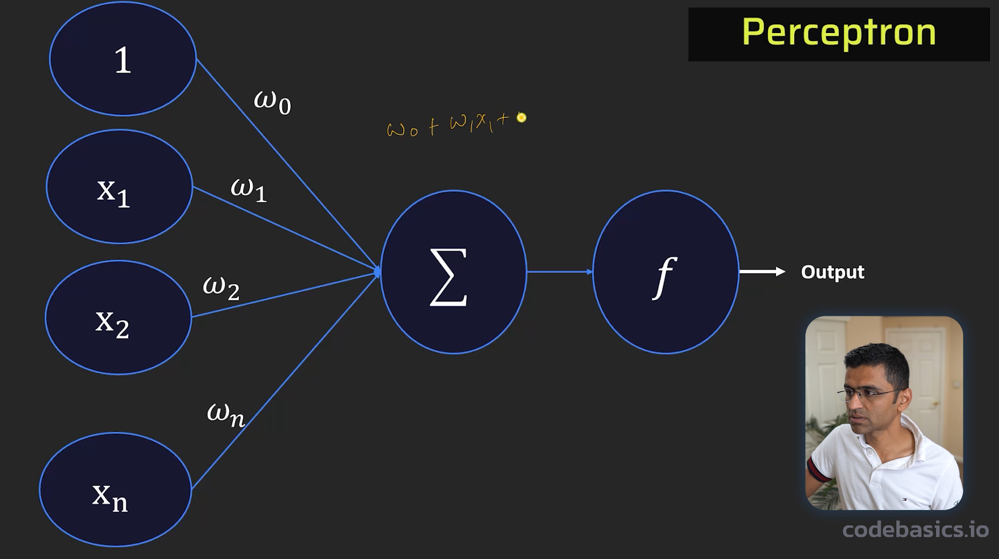
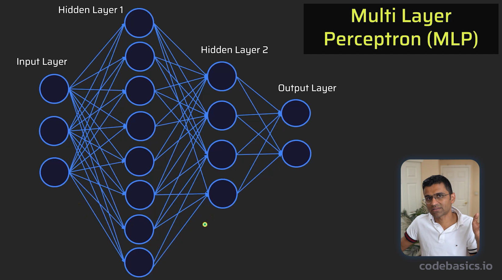

# 🧠 Neural Networks Basics: Perceptron, MLP & Feedforward Neural Network

This document explains the core concepts of neural networks in a structured and easy-to-understand way. It includes:

- Perceptron  
- Bias  
- Activation Functions (Step & Sigmoid)  
- Multilayer Perceptron (MLP)  
- Feedforward Neural Network (FNN)

---

# 📌 1. What is a Perceptron?

A perceptron is the simplest form of an artificial neural network. It is a basic decision-making unit that takes input data and produces a single output.

It is inspired by how a biological neuron works in the brain.

diagram:

Step 1: proper nueuron which is we divided middle one

Step 2:
we convert 2 part 2 task complete 2 part

---

## 🧠 Simple Definition

A perceptron:

- Takes inputs
- Assigns weights
- Adds bias
- Applies activation function
- Produces output (0 or 1)

---

## ⚙️ Mathematical Form

\[
z = w_1x_1 + w_2x_2 + w_3x_3 + b
\]

Then:

\[
output = activation(z)
\]

---

## 🧩 Headnote

Perceptron = weighted sum + bias + activation → decision

---

## ⚠️ Limitation

- Works only for linear problems
- Cannot solve XOR-type problems

---

# 📌 2. What is Bias?

Bias is a learnable parameter that helps shift the activation function.

---

## 🧠 Simple Meaning

Bias acts like a **shift control knob** that adjusts the model output.

---

## ⚙️ Formula

\[
z = w_1x_1 + w_2x_2 + ... + b
\]

---

## 🎯 Why Bias is Important?

- Improves model flexibility
- Helps fit data properly
- Prevents rigid decision boundaries

---

## 🧠 How Bias is Learned

Bias is learned using gradient descent:

\[
b = b - \alpha \frac{\partial Loss}{\partial b}
\]

---

## 🧩 Headnote

Bias = adjustable constant that improves learning

---

# 📌 3. Step Function

Step function is a binary activation function used in early neural networks.

---

## ⚙️ Formula

\[
f(z)=
\begin{cases}
1 & z \ge 0 \\
0 & z < 0
\end{cases}
\]

---

## 🧠 Idea

- If condition is satisfied → 1
- Otherwise → 0

---

## ⚠️ Limitation

- Not smooth
- Not suitable for deep learning

---

# 📌 4. Sigmoid Activation Function

Sigmoid converts any input into a probability value between 0 and 1.

---

## ⚙️ Formula

\[
\sigma(z) = \frac{1}{1 + e^{-z}}
\]

---

## 🎯 Output Behavior

- Positive input → near 1
- Negative input → near 0
- Zero → 0.5

---

## 🧠 Example

- Spam detection → 0.9 = spam
- Not spam → 0.1

---

## 🧩 Headnote

Sigmoid = probability generator (0 to 1)

---

# 📌 5. Multilayer Perceptron (MLP)

MLP is a neural network that contains multiple layers of perceptrons.

---

## 🧱 Structure

### 🔹 Input Layer
Receives raw features

### 🔹 Hidden Layers
Performs feature learning

### 🔹 Output Layer
Gives final prediction

---

## ⚙️ Flow

\[
Input → Hidden Layers → Output
\]

---

## 🎯 Example

Spam detection:
- Input → email text
- Hidden layer → detects patterns
- Output → spam or not spam

---

## 🔥 Why MLP is Powerful?

- Solves nonlinear problems
- Works for image recognition
- Solves XOR problem

---

# 📌 6. Feedforward Neural Network (FNN)

A Feedforward Neural Network is the **most basic type of artificial neural network** where information moves in only one direction:

👉 From input → hidden layers → output

There is **no backward flow or loops**.

---

## 🧠 Simple Definition

A Feedforward Neural Network is a network where data flows forward only, without cycles or memory.

---

## ⚙️ Structure of FNN

### 🔹 Input Layer
- Takes input features
- Example: age, salary, pixels

### 🔹 Hidden Layers
- Perform transformations
- Extract patterns

### 🔹 Output Layer
- Produces final result

---

## 🔁 Data Flow

\[
Input \rightarrow Hidden Layers \rightarrow Output
\]

No feedback loops exist.

---

## 🎯 Real-Life Example

### Email Spam Detection

- Input: email text
- Hidden layer: learns patterns like “FREE”, “CLICK HERE”
- Output:
  - 1 → Spam
  - 0 → Not Spam

---

## 📊 Key Properties

- Data flows in one direction only
- No memory of previous inputs
- Easy to train compared to recurrent networks

---

## ⚠️ Limitations

- Cannot handle sequential data (like speech or time series)
- No memory of past inputs

---

## 🧠 Difference: FNN vs Other Networks

| Type | Direction | Memory |
|------|----------|--------|
| FNN | One-way | No memory |
| RNN | Loop | Has memory |

---

## 🧩 Headnote

Feedforward Neural Network = one-direction flow from input to output without loops

---

# 🚀 Final Summary

| Concept | Meaning |
|----------|--------|
| Perceptron | Basic neuron |
| Bias | Shift adjustment |
| Step Function | Binary output |
| Sigmoid | Probability function |
| MLP | Multi-layer network |
| FNN | One-direction neural network |

---

# ⚡ Final Insight

Neural networks evolve step by step:

Perceptron → MLP → Feedforward Neural Network → Deep Learning Models

---
