# Type of Activation Function

## Activation Function

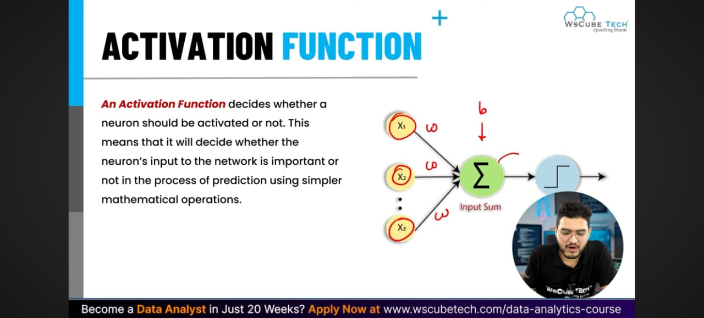

An activation function is a mathematical component in an artificial neural network. It sits inside each neuron and decides whether the neuron should "fire" (pass its signal to the next layer) or not. It transforms the weighted sum of inputs into a final, actionable output.Why Are They Important?Activation functions perform a few critical jobs in a neural network:Introduce Non-Linearity: Without them, a neural network is just a series of linear regression equations (essentially a straight line). Activation functions bend and curve the network's output, allowing it to learn and map complex patterns.Control Signal Flow: They normalize the output of a neuron, keeping values within a specific, controlled range or scale (such as between -1 and 1).Enable Learning: They provide mathematical gradients, which are essential for the backpropagation process. Without this, a network cannot correct its mistakes and learn over time.

### Why Are They Important?

Activation functions perform a few critical jobs in a neural network:

- **Introduce Non-Linearity:** Without them, a neural network is just a series of linear regression equations (essentially a straight line). Activation functions bend and curve the network's output, allowing it to learn and map complex patterns.

- **Control Signal Flow:** They normalize the output of a neuron, keeping values within a specific, controlled range or scale (such as between -1 and 1).

- **Enable Learning:** They provide mathematical gradients, which are essential for the backpropagation process. Without this, a network cannot correct its mistakes and learn over time

## Activation Function categorizes

### The Activation Function is categorized into **Three** main parts.

**Binary Step Function** gives output either 0 or 1, meaning it simply decides YES or NO. If the input value is above a certain limit, it outputs 1 (activated), and if it is below, it outputs 0 (not activated). It is the simplest form of activation function but is not useful for complex problems.

** Linear Activation Function** gives a straight line output, meaning the output is directly proportional to the input. It is used for simple and basic problems, but the main problem with this function is that it cannot learn complex patterns because it always gives a linear output no matter how many layers are used in the network.

**Non-Linear Activation Function** is the most commonly used in deep learning because it can learn complex patterns and relationships in data. It allows the neural network to understand complicated data and make better predictions. Popular non-linear functions like ReLU, Sigmoid, and Tanh come under this category, and each one works differently to help the network learn and perform well on real world problems.

## Activation Function Types

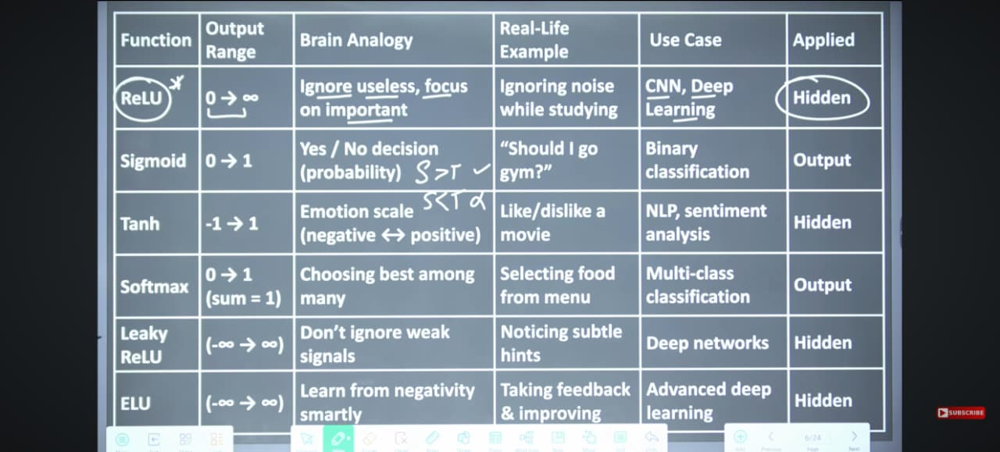

**ReLU**
ReLU outputs values from 0 to infinity. It is commonly used in hidden layers of CNNs and deep learning models. By ignoring negative values (setting them to zero), ReLU helps the network focus only on important signals. The brain analogy is “ignore useless, focus on important,” like ignoring background noise while studying.

**Sigmoid**
Sigmoid squashes any input into an output range between 0 and 1. This makes it ideal for binary classification, where the result is a yes/no or probability-like decision. For example, “Should I go to the gym?” is a real-life binary choice. Sigmoid is typically placed at the output layer.

Tanh
Tanh outputs values between -1 and 1, which allows it to represent both negative and positive sentiments. It is often used in hidden layers for NLP and sentiment analysis tasks. A good real-life analogy is liking or disliking a movie – a clear emotional scale from negative to positive.

**Softmax**
Softmax also outputs between 0 and 1, but with the extra condition that all outputs sum to exactly 1. This makes it perfect for multi-class classification, where the model must choose the best among many options – like selecting a dish from a menu. Softmax is always used at the output layer.

Leaky ReLU
Leaky ReLU has an output range from negative infinity to infinity. Unlike standard ReLU, it does not completely kill negative values; instead, it allows a small, non-zero slope for negatives. This helps the network avoid ignoring weak but potentially useful signals. The brain analogy is “noticing subtle hints” instead of discarding them.

**ELU**
ELU (Exponential Linear Unit) also outputs from negative infinity to infinity. It handles negative values more smoothly than Leaky ReLU by saturating to a negative constant. This leads to better learning dynamics in advanced deep learning models. The real-life analogy is “taking feedback and improving” – learning from negativity intelligently.

**Step Function**
Outputs either 0 or 1. Brain analogy: all-or-nothing decision. Real-life example: deciding “Will I take an umbrella?” based on a rain threshold. Use case: basic perceptrons, theoretical models. Applied at: output layer (binary classification).

## Binary Step Function

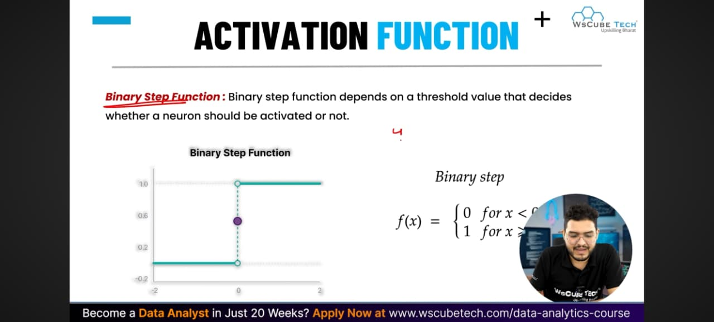

The binary step function outputs either 0 or 1 depending on a threshold. In its standard form, if the input x is less than 0, the output is 0; if x is greater than or equal to 0, the output is 1. The brain analogy is an “all‑or‑nothing” decision – a neuron either fires fully or not at all. A real‑life example is a light switch: either on (1) or off (0). This function was historically used in the perceptron model. However, it is rarely used in modern deep learning because its derivative is zero almost everywhere (no gradient for learning). When it is used, it appears at the output layer for strict binary classification tasks.

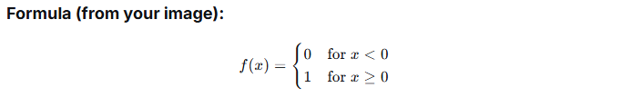

## Linear Activation Function

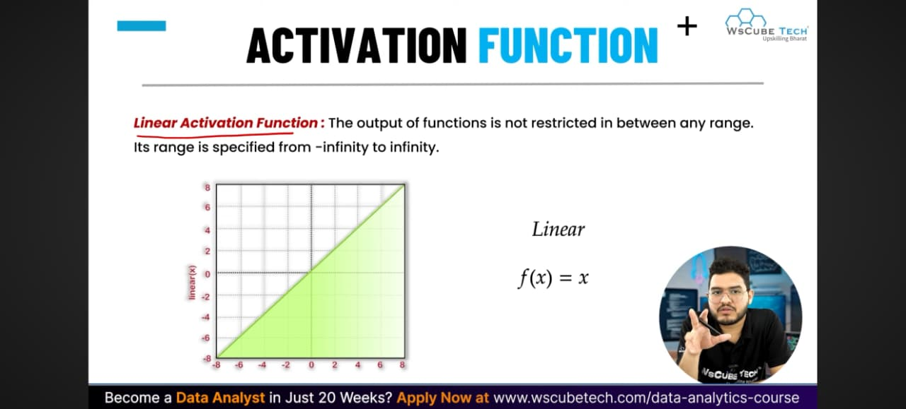

The linear activation function outputs the input value directly, with no restriction on range – it goes from -infinity to +infinity. The formula is simply f(x) = x. The brain analogy is “no filter, pass everything as is” – like hearing a sound and repeating it exactly without interpretation. A real‑life example is a volume control knob: turning it up or down changes the output proportionally without any cutoff. This function is sometimes used in the output layer of regression problems where the target value can be any real number (e.g., predicting house prices or temperature). However, it is rarely used in hidden layers because stacking linear functions still results in a linear model, which cannot learn complex patterns. When applied, it is placed at the output layer for regression tasks.

**linear Formula**, f(x) = x

## Non-linear Activation Function

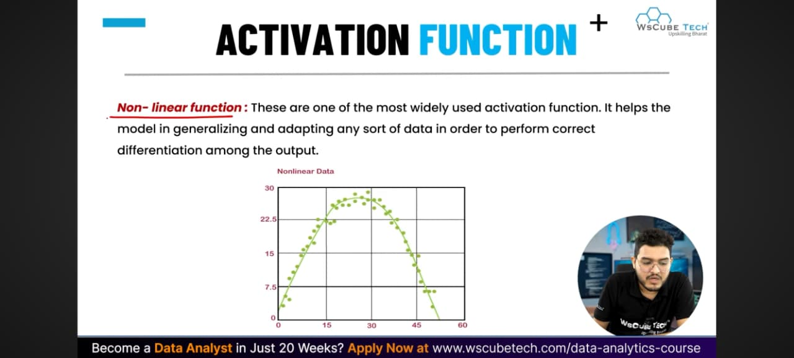

Non-linear activation functions are the most widely used type in modern neural networks. Unlike linear functions, they introduce non-linearity into the model, which allows the network to learn complex patterns, generalize well, and adapt to any kind of data. The brain analogy is “thinking beyond straight lines” – like understanding that not all problems have direct, proportional answers. A real‑life example is deciding what to eat based on mood, time, and cravings – a non-linear combination of factors. These functions are used in hidden layers of almost all deep learning models (CNNs, RNNs, transformers) to enable correct differentiation between outputs. Common examples include ReLU, Sigmoid, Tanh, Leaky ReLU, ELU, and Softmax. Without non-linear activation functions, stacking multiple layers would still behave like a single linear layer, which cannot solve complex tasks like image recognition or language understanding.

**No single formula** – non-linear activation functions include many variants 

e.g., **ReLU:** f(x) = X, max(0, x)

**Sigmoid:** f(x) = 1 / (1 + e^-Z)

## Non-Linear Neural Networks Activation Functions

The image lists the four most commonly used non-linear activation functions in deep learning: **Sigmoid (Logistic), Tanh (Hyperbolic Tangent), ReLU, and Softmax**. Each of these introduces non-linearity, allowing neural networks to learn complex patterns. Sigmoid outputs between 0 and 1, ideal for binary classification. Tanh outputs between -1 and 1, making it suitable for sentiment analysis and NLP. ReLU outputs from 0 to infinity, ignoring negative values for efficiency – the default choice for hidden layers in CNNs and deep networks. Softmax outputs probabilities that sum to 1, used for multi-class classification. Together, they form the backbone of most modern neural architectures. Detailed explanations for each function were provided in earlier notes.

## Sigmoid / Logistic Activation Function

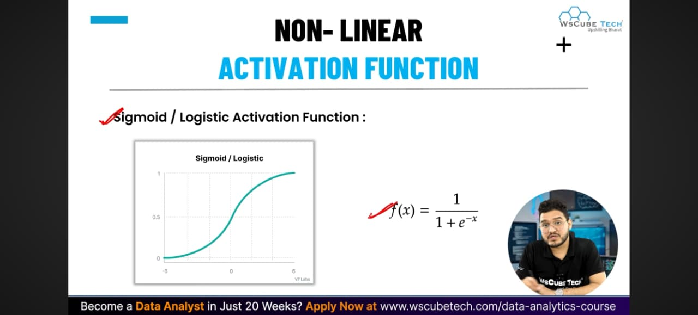

The sigmoid (or logistic) activation function squashes any real-valued input into an output range between 0 and 1. Its formula is **f(x) = 1 / (1 + e^-Z)**. The brain analogy is a “yes/no probability neuron” – it decides how likely something is true, not just a hard yes or no. A real‑life example is “Should I go to the gym?” – the answer is not just 0 or 1 but a confidence level (e.g., 80% yes). The sigmoid function is primarily used in the output layer of binary classification problems where the model needs to predict a probability (e.g., spam or not spam, win or lose). It is rarely used in hidden layers anymore because it suffers from the “vanishing gradient” problem in deep networks. When applied, it is placed at the output layer for binary classification.

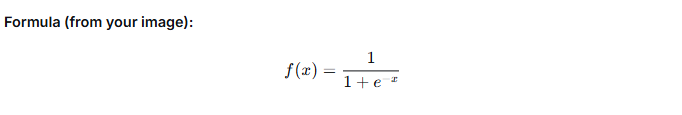

## Tanh Function (Hyperbolic Tangent)

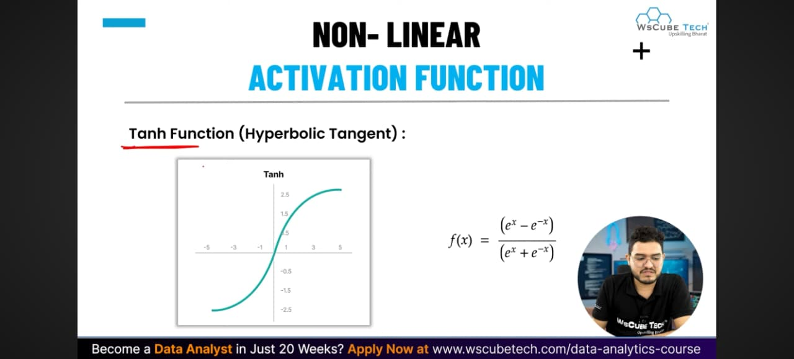

The Tanh (hyperbolic tangent) activation function squashes any real-valued input into an output range between -1 and 1. Its formula is, ** f(x) = (e^x - e^-x) / (e^x + e^-x). The brain analogy is an “emotion scale from negative to positive” – it captures both dislikes (-1) and likes (+1) with a neutral midpoint at 0. A real‑life example is liking or disliking a movie – ratings can be strongly negative, neutral, or strongly positive. Tanh is commonly used in hidden layers of NLP (natural language processing) and sentiment analysis because it preserves the direction of the signal (positive vs. negative). Compared to Sigmoid, Tanh is zero-centered, which often leads to better gradient flow during training. However, it still suffers from the vanishing gradient problem in very deep networks. When applied, it is placed at hidden layers for tasks where capturing positive/negative relationships matters.

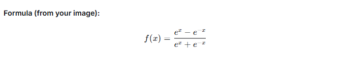

## Softmax Function

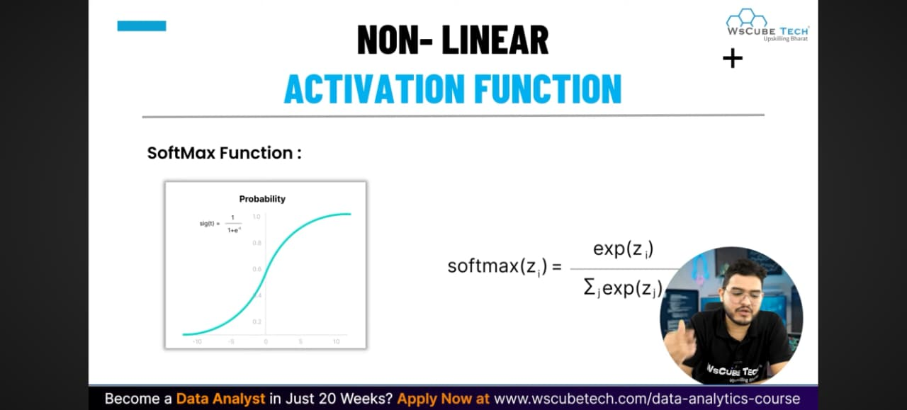

The Softmax function converts a vector of raw output values (logits) into a probability distribution over multiple classes. Its formula is softmax, **softmax(Zi) = exp(Zi) / ∑j exp(Zj)** where each output is between 0 and 1 and the sum of all outputs equals exactly 1. The brain analogy is “choosing the best among many options” – like a group of people voting, and the winner gets the highest probability. A real‑life example is selecting a dish from a menu – each dish gets a probability, and the sum of all probabilities is 100%. Softmax is used exclusively in the output layer of multi-class classification problems (e.g., recognizing handwritten digits 0-9, classifying animal species). It is not used in hidden layers. Compared to Sigmoid (which handles two classes), Softmax handles any number of classes naturally.

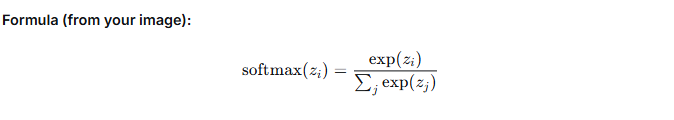

##  ReLU Function (Rectified Linear Unit)

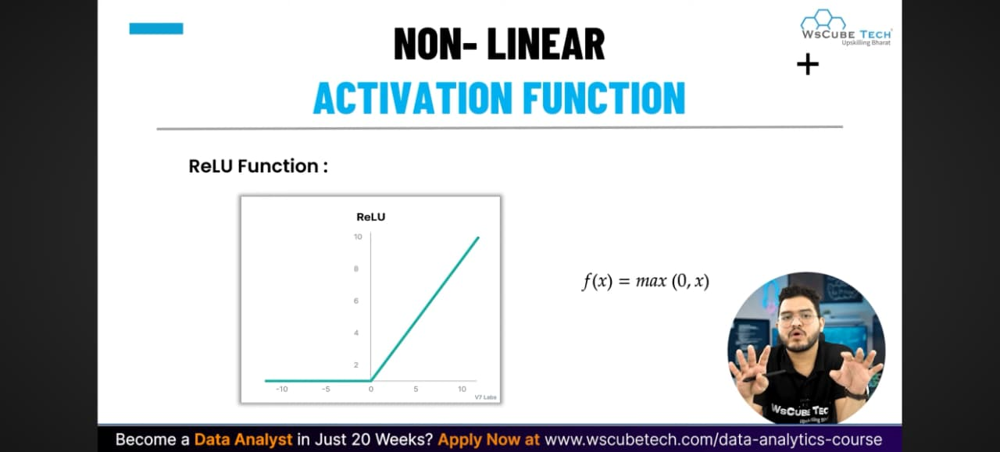

The ReLU (Rectified Linear Unit) activation function outputs the input directly if it is positive, and zero otherwise. Its range is from 0 to infinity. The formula is f(x)=max(0,x). The brain analogy is “ignore useless, focus on important” – like a student who only pays attention to relevant study material and ignores background noise. A real‑life example is studying in a noisy café: you focus on your book (positive input) and completely ignore the coffee machine noise (negative input). ReLU is the most popular activation function for hidden layers in CNNs and deep learning models because it is computationally efficient and helps mitigate the vanishing gradient problem. It is placed at hidden layers throughout the network. However, it has a drawback: “dying ReLU” where neurons can become permanently inactive if they always receive negative inputs. Variants like Leaky ReLU and ELU address this issue.

**Formula (from your image):** f(x) = max (0 , x)

## Leaky ReLU Function

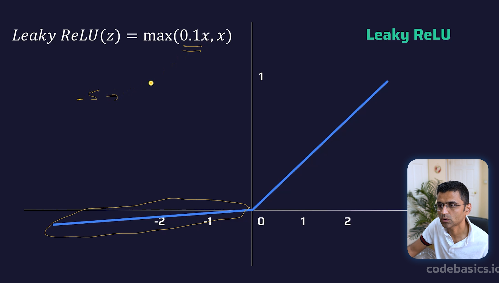

The Leaky ReLU activation function is a variant of ReLU that allows a small, non-zero gradient for negative input values, instead of setting them to zero. Its output range is from -infinity to infinity. The standard formula is f(x)=max(αx,x), where α (alpha) is a small constant, typically 0.01 or 0.1. The brain analogy is “don’t ignore weak signals” – like noticing subtle hints or background cues instead of dismissing them entirely. A real‑life example is listening to a conversation in a noisy room: you still pay some attention to the quieter sounds, not just the loud ones. Leaky ReLU is used in hidden layers of deep networks to prevent “dying ReLU” (neurons that never activate). It is placed at hidden layers where preserving weak negative information might be useful.

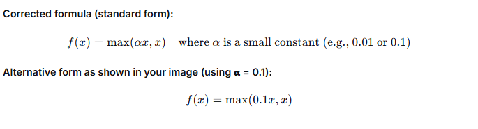

## Step Function

The step function (also called binary step or threshold function) outputs a binary value based on whether the input crosses a threshold. Typically, it outputs 0 for inputs less than 0 and 1 for inputs greater than or equal to 0. The brain analogy is an “all-or-nothing decision” – like a light switch that is either completely on or completely off. A real‑life example is “Will I take an umbrella?” – if the chance of rain is above a threshold (say 50%), answer yes; otherwise, no. The step function was historically used in the perceptron model but is rarely used in modern deep learning because its derivative is zero almost everywhere, making gradient-based learning impossible. When used, it appears at the output layer for strict binary classification.

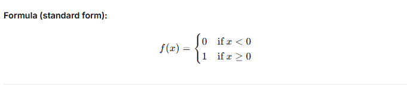

## How to Choose the Right Activation Function?

Choosing the correct activation function depends primarily on your output layer and the type of prediction problem. For regression problems (predicting a continuous value like house price or temperature), use the Linear activation function because the output can be any real number. For binary classification (yes/no, spam/not spam), use the Sigmoid (Logistic) activation function – it outputs a probability between 0 and 1. For multi-class classification (one class among many, e.g., digit recognition 0-9), use the Softmax activation function – it outputs a probability distribution summing to 1. For multilabel classification (multiple independent yes/no outputs, e.g., tagging multiple objects in an image), use Sigmoid independently for each output node because each label is a separate binary decision. These rules apply specifically to the output layer. For hidden layers, ReLU and its variants are generally preferred.

**Summary table from your image:**

| Prediction Problem          | Output Activation Function |
|-----------------------------|----------------------------|
| Regression                  | Linear                     |
| Binary Classification       | Sigmoid / Logistic         |
| Multiclass Classification   | Softmax                    |
| Multilabel Classification   | Sigmoid                    |

## How to Choose the Right Activation Function?

The choice of activation function for hidden layers depends on the type of neural network architecture. For Convolutional Neural Networks (CNNs) – used for image processing and computer vision – the ReLU activation function is the standard choice. ReLU is fast, helps mitigate vanishing gradients, and introduces sparsity. For Recurrent Neural Networks (RNNs) – used for sequential data like time series, text, and speech – the Tanh and/or Sigmoid activation functions are commonly used. Tanh provides a zero‑centered output (good for capturing positive/negative states), while Sigmoid acts as a gating mechanism (e.g., in LSTM networks). These choices are general guidelines; modern variants like Leaky ReLU or ELU may also be used in CNNs, and Tanh remains popular in RNNs.

| Neural Network Architecture         | Hidden Layer Activation |
|-------------------------------------|-------------------------|
| CNN (Convolutional Neural Network)  | ReLU                    |
| RNN (Recurrent Neural Network)      | Tanh and/or Sigmoid)    |

