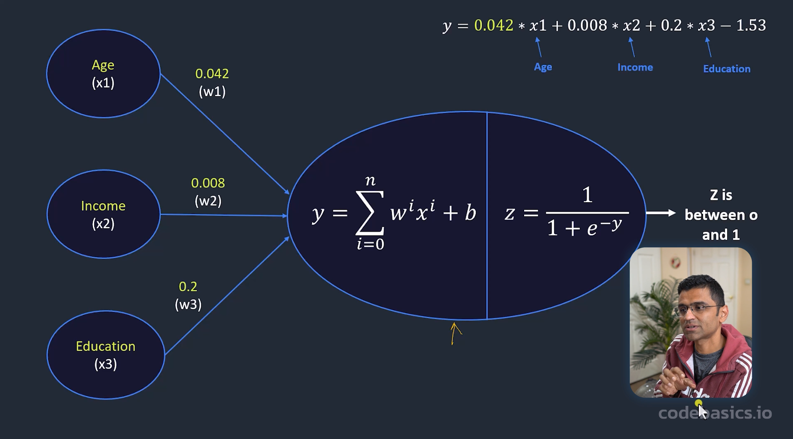
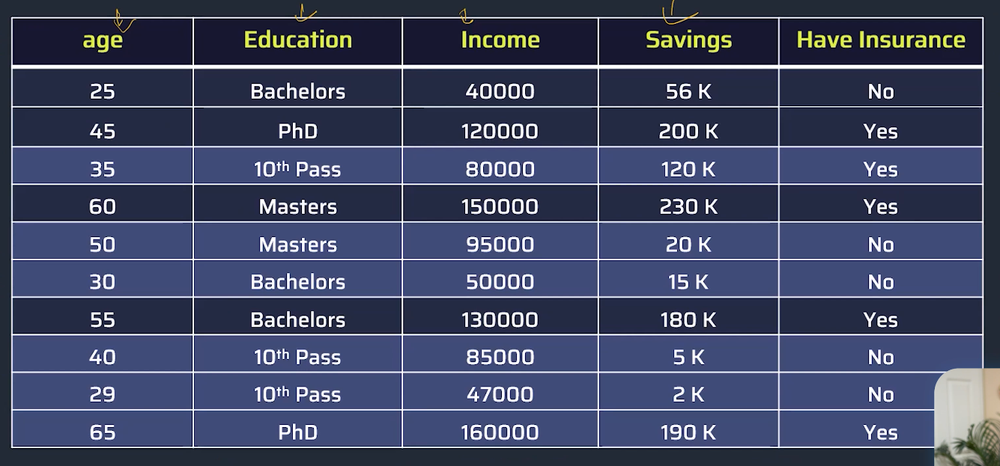
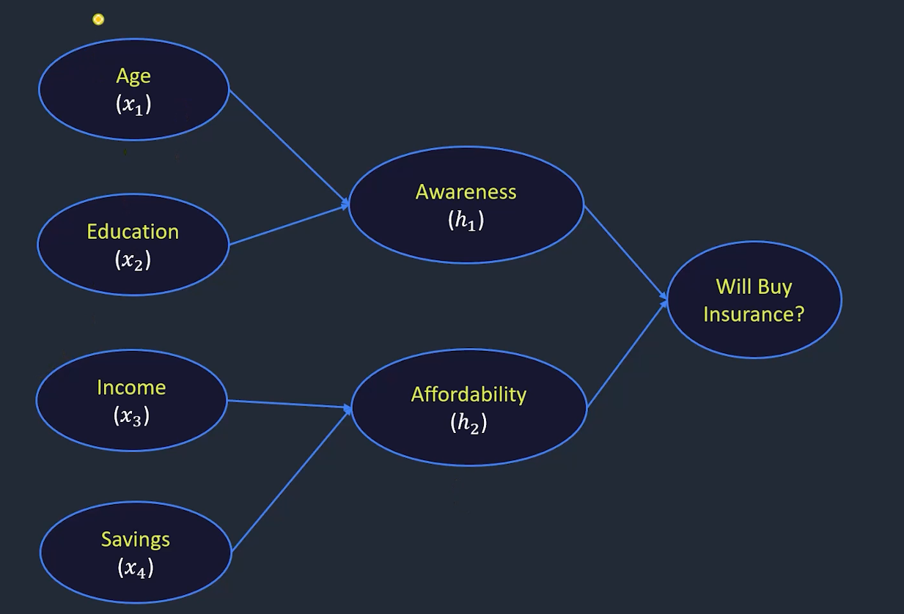
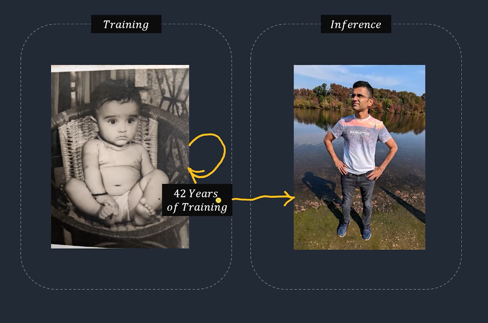
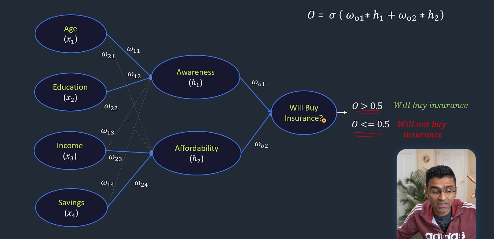

# 🧠 Insurance Purchase Prediction using Neural Network

## 📖 Project Description

This project is a beginner-friendly Neural Network project 
that predicts whether a customer will buy insurance or not. 
It is based on a tutorial from codebasics.io and covers 
the fundamental concepts of how a neural network works 
from scratch using real-world data.

The main idea is simple. Insurance companies want to know 
which customers are likely to purchase their products. 
Instead of guessing or using simple rules, we use a 
Neural Network that learns patterns from historical 
customer data and makes smart predictions on new customers.

This project is perfect for beginners who want to 
understand how neural networks work in a real-world 
scenario without getting lost in complicated math. 
Every step is explained clearly with simple words, 
diagrams, and working Python code.

---

## 🎯 Problem Statement

Imagine you work for an insurance company. Every day, 
hundreds of new customers visit your website. You cannot 
call every single person to sell insurance. You need to 
know in advance WHO is likely to buy insurance so your 
sales team can focus on the RIGHT customers.

The question we are trying to answer is:

    "Based on a customer's Age, Education, Income, 
     and Savings, will they BUY insurance or NOT?"

This is a BINARY CLASSIFICATION problem because the 
answer is only one of two things:
    ✅ YES - They will buy insurance
    ❌ NO  - They will not buy insurance

---

## 🤔 Why Use Neural Network?

You might wonder, why not use simple rules like:
    "If age > 40 AND income > 100000 → Will buy"

The problem with simple rules is:
    ❌ They miss complex combinations of factors
    ❌ They don't learn from data automatically  
    ❌ They fail when patterns are not obvious
    ❌ Real world is not black and white

Neural Networks are better because:
    ✅ They learn patterns AUTOMATICALLY from data
    ✅ They consider ALL features TOGETHER
    ✅ They find HIDDEN patterns humans cannot see
    ✅ They improve as they see MORE data
    ✅ They handle complex real-world scenarios

---

## 📸 Detailed Image Explanations

### IMAGE 1: How a Single Neuron Works


The Building Block of Every Neural Network

A neuron is the most basic unit of a neural network. 
Think of it like a single brain cell that takes in 
information, processes it, and gives an output.

In this image, we can see ONE neuron with THREE inputs:
Age (x1), Income (x2), and Education (x3). Each input 
has a WEIGHT attached to it. The weight tells the neuron 
how IMPORTANT that particular input is for making 
the final decision.

For example:
- Age has weight 0.042 (small importance)
- Income has weight 0.008 (very small importance)  
- Education has weight 0.2 (bigger importance)

This means Education level matters MORE than Age or 
Income when deciding if someone will buy insurance.

The neuron does TWO things:
FIRST - It multiplies each input by its weight and 
        adds them all together with a BIAS value.
        This gives us a number called 'y'.

SECOND - It passes 'y' through a SIGMOID function.
         Sigmoid is a special math function that 
         converts ANY number into a value between 
         0 and 1. This output is like a PROBABILITY.
         
         0.9 means 90% chance of buying insurance
         0.1 means 10% chance of buying insurance

The BIAS (-1.53) is like a default offset. It shifts 
the result up or down. Think of it as the baseline 
tendency of a person to buy insurance before we 
even consider their age, income, or education.

This single neuron concept is the FOUNDATION of 
understanding how much bigger neural networks work!

**The Formula**

━━━━━━━━━━━━━━━━━━━━━━━━━━━━━━━━━━━━━━━━━━━━━━━━
FORMULA 1: Weighted Sum
━━━━━━━━━━━━━━━━━━━━━━━━━━━━━━━━━━━━━━━━━━━━━━━━

y = (w1 × x1) + (w2 × x2) + (w3 × x3) + bias

y = (0.042 × Age) + 
    (0.008 × Income) + 
    (0.2   × Education) + 
    (-1.53)

Every input is MULTIPLIED by its weight
Then all results are ADDED together
Then BIAS is added at the end

━━━━━━━━━━━━━━━━━━━━━━━━━━━━━━━━━━━━━━━━━━━━━━━━
FORMULA 2: Sigmoid Activation
━━━━━━━━━━━━━━━━━━━━━━━━━━━━━━━━━━━━━━━━━━━━━━━━

z = 1 / (1 + e^(-y))

This converts result to 0-1 range:
    y = 10  → z = 0.9999 (almost certain YES)
    y = 2   → z = 0.88   (likely YES)
    y = 0   → z = 0.50   (50/50 chance)
    y = -2  → z = 0.12   (likely NO)
    y = -10 → z = 0.0001 (almost certain NO)


**🎯 Visual Flow**

                    NEURON
                 ┌──────────────────────────────┐
Age (x1=45)  ───┤× 0.042 = 1.89               │
                 │                              │
Income(x2=   ───┤× 0.008 = 960    SUM → y ────┤→ Sigmoid → z (0 to 1)
     120000)     │                              │
                 │                              │
Education    ───┤× 0.2   = 0.6    + bias=-1.53│
(x3=3/PhD)       └──────────────────────────────┘

y = 1.89 + 960 + 0.6 - 1.53 = 960.96
z = 1/(1+e^-960.96) ≈ 1.0
→ 100% probability → WILL BUY INSURANCE ✅

**💡 Key Takeaways from Image 1**

┌─────────────────────────────────────────────────────┐
│ 1. Weight = Importance of each input feature        │
│    Higher weight = More influence on decision       │
│                                                     │
│ 2. Bias = Baseline adjustment                       │
│    Like saying "by default, people lean toward NO" │
│                                                     │
│ 3. Sigmoid = Converts to probability (0 to 1)       │
│    Makes output interpretable as percentage         │
│                                                     │
│ 4. The NEURAL NETWORK learns the best weights       │
│    automatically through training!                  │
│    We don't set them manually.                     │
└─────────────────────────────────────────────────────┘


## 🖼️ IMAGE 2: The Dataset



**The Training Data - Examples Neural Network Learns From**

Before a Neural Network can make any predictions, it 
needs to LEARN from examples. Just like how a student 
reads many textbooks and practice questions before 
taking an exam, the neural network reads through many 
customer records to learn the patterns.

This dataset contains 10 customer records. Each record 
has 4 features (inputs) and 1 target (output):

FEATURES (What we know about the customer):
→ Age: How old is the customer?
→ Education: What is their education level?
→ Income: How much do they earn per year?
→ Savings: How much money have they saved?

TARGET (What we want to predict):
→ Have Insurance: Did they actually buy insurance? Yes/No

When we look carefully at the data, we can spot some 
interesting patterns:

PATTERN 1: People with HIGH savings tend to buy insurance.
Look at Age=45 (Savings=200K → YES) vs Age=50 (Savings=20K → NO).
Same education level (graduate), but savings makes the difference!

PATTERN 2: Young people with low savings don't buy.
Age=25 (Savings=56K → NO), Age=29 (Savings=2K → NO).
Even if income is reasonable, low savings = NO.

PATTERN 3: Older people with high savings buy insurance.
Age=60 (Savings=230K → YES), Age=65 (Savings=190K → YES).
They understand the value AND can afford it.

The Neural Network learns ALL these patterns automatically 
by going through this data hundreds of times during training!

**Dataset with Analysis**

┌─────┬───────────┬─────────┬─────────┬──────────────┬──────────────┐
│ Age │ Education │ Income  │ Savings │ Insurance    │ Analysis     │
├─────┼───────────┼─────────┼─────────┼──────────────┼──────────────┤
│ 25  │ Bachelors │ 40,000  │ 56K     │ ❌ No        │ Young+Low$   │
│ 45  │ PhD       │ 120,000 │ 200K    │ ✅ Yes       │ Mid+High$    │
│ 35  │ 10th Pass │ 80,000  │ 120K    │ ✅ Yes       │ Good Savings │
│ 60  │ Masters   │ 150,000 │ 230K    │ ✅ Yes       │ Old+Rich     │
│ 50  │ Masters   │ 95,000  │ 20K     │ ❌ No        │ Low Savings! │
│ 30  │ Bachelors │ 50,000  │ 15K     │ ❌ No        │ Young+Low$   │
│ 55  │ Bachelors │ 130,000 │ 180K    │ ✅ Yes       │ Old+High$    │
│ 40  │ 10th Pass │ 85,000  │ 5K      │ ❌ No        │ No Savings!  │
│ 29  │ 10th Pass │ 47,000  │ 2K      │ ❌ No        │ No Savings!  │
│ 65  │ PhD       │ 160,000 │ 190K    │ ✅ Yes       │ Old+Rich     │
└─────┴───────────┴─────────┴─────────┴──────────────┴──────────────┘

KEY INSIGHT FROM DATA:
━━━━━━━━━━━━━━━━━━━━━━━━━━━━━━━━━━━━━━━━━━━━━━━
✅ YES Pattern: Usually Older + Higher Savings
❌ NO Pattern:  Usually Younger + Lower Savings

IMPORTANT: Income alone is NOT enough!
Age=50, Masters, Income=95K, Savings=20K → ❌ NO
Savings matters more than just income!

**🔢 Data Preprocessing Needed**

PROBLEM: Neural Networks only understand NUMBERS
Education column has TEXT values!

SOLUTION: Label Encoding
━━━━━━━━━━━━━━━━━━━━━━━━━━━━━━
10th Pass  →  0
Bachelors  →  1
Masters    →  2
PhD        →  3

Also need to SCALE all numbers to same range (0-1):
━━━━━━━━━━━━━━━━━━━━━━━━━━━━━━
Age:    25-65    → 0.0 to 1.0
Income: 40K-160K → 0.0 to 1.0
Savings:2K-230K  → 0.0 to 1.0

This is called MIN-MAX NORMALIZATION
It prevents large numbers from dominating!


## 🖼️ IMAGE 3: Neural Network Architecture



**The Big Picture - How the Network is Structured**

This image shows the overall structure of our Neural 
Network. It is called the ARCHITECTURE of the network 
and it tells us how many layers there are, how many 
neurons are in each layer, and how they connect.

Our network has THREE layers:

LAYER 1 - INPUT LAYER (4 neurons):
This is where raw customer data enters the network.
Each input neuron represents one feature:
→ x1 = Age
→ x2 = Education  
→ x3 = Income
→ x4 = Savings
These neurons don't do any calculation. They just 
receive and pass the data forward.

LAYER 2 - HIDDEN LAYER (2 neurons):
This is the most interesting layer! It is called 
"hidden" because we cannot directly see what it 
is doing just by looking at inputs and outputs.
The two hidden neurons are:
→ h1 = Awareness neuron
→ h2 = Affordability neuron

The AWARENESS neuron tries to capture whether a 
person understands the importance of insurance.
This is influenced by their Age (older people 
think more about future security) and Education 
(educated people understand insurance better).

The AFFORDABILITY neuron tries to capture whether 
a person can financially support an insurance 
premium. This is influenced by Income and Savings.

IMPORTANT NOTE: In real life, the neural network 
does NOT know these neurons represent "awareness" 
and "affordability". These are just human-friendly 
names we gave to explain the concept. The network 
just learns mathematical patterns on its own!

LAYER 3 - OUTPUT LAYER (1 neuron):
This gives the final answer. It takes the output 
from both hidden neurons and combines them to 
produce a single probability value between 0 and 1.

**🏗️ Architecture Diagram**

INPUT LAYER        HIDDEN LAYER          OUTPUT LAYER
(4 neurons)        (2 neurons)           (1 neuron)
                   
                   ┌──────────────┐
Age (x1) ──────────┤              │
                   │  Awareness   │──────────┐
Education(x2)──────┤     (h1)     │          │      Will Buy
                   │              │          ├────→ Insurance?
                   └──────────────┘          │      (0 or 1)
                                             │
                   ┌──────────────┐          │
Income (x3)────────┤              │          │
                   │Affordability │──────────┘
Savings (x4)───────┤     (h2)     │
                   │              │
                   └──────────────┘

Each arrow has a WEIGHT (learned during training)
More connections = More patterns can be learned!

**💡 Why 2 Hidden Neurons?**

We chose 2 hidden neurons because of real-world logic:

REASON 1: Matches human decision making
  Humans think about 2 main things:
  "Do I understand it?" AND "Can I afford it?"
  So 2 neurons makes intuitive sense.

REASON 2: Keeps model simple
  With only 10 training samples, a bigger network
  would OVERFIT (memorize data, not learn patterns)
  
REASON 3: In practice
  You experiment with different numbers and
  pick what gives best results on test data.
  This is called HYPERPARAMETER TUNING.

## 🖼️ IMAGE 4: Training vs Inference



This is one of the most important concepts in all of 
machine learning. The image uses a beautiful analogy 
of a BABY growing into an ADULT over 42 years to 
explain the difference between Training and Inference.

TRAINING PHASE (The Baby):
When a baby is born, it knows nothing about the world. 
Over many years, it learns by seeing examples, making 
mistakes, getting corrected, and trying again. After 
42 years of this learning process, the baby becomes 
a knowledgeable adult.

A Neural Network starts exactly like a baby. When we 
first create it, all the weights are set to RANDOM 
values. The network knows nothing useful yet.

During training, the network:
STEP 1: Looks at a customer's data (age, income etc.)
STEP 2: Makes a prediction with current random weights
STEP 3: Compares prediction to the ACTUAL answer
STEP 4: Calculates the ERROR (how wrong it was)
STEP 5: Uses BACKPROPAGATION to figure out which 
         weights caused the error
STEP 6: ADJUSTS those weights to reduce the error
STEP 7: Repeats this for ALL training examples
STEP 8: Does this entire cycle HUNDREDS of times
         (each cycle is called an EPOCH)

After enough training epochs, the weights are no 
longer random. They have been carefully tuned to 
capture the real patterns in the data.

INFERENCE PHASE (The Adult):
Once training is complete, the model is ready to 
make predictions on NEW customers it has never 
seen before. This is called INFERENCE.

During inference, the weights are FROZEN (not 
changed). The network just uses what it already 
learned to make fast, accurate predictions.

This is exactly like an adult using their 42 years 
of knowledge and experience to make smart decisions 
quickly, without needing to learn from scratch!


**🔄 Training Process Step by Step**

BEFORE TRAINING:
━━━━━━━━━━━━━━━━━━━━━━━━━━━━━━━━━━━━━━
All weights = Random numbers (e.g., 0.43, -0.21, 0.87...)
Network makes random predictions (basically guessing)

DURING TRAINING (Each Epoch):
━━━━━━━━━━━━━━━━━━━━━━━━━━━━━━━━━━━━━━
Epoch 1:   
  Predict: 0.3 | Actual: 1 | Error: BIG ❌
  → Adjust weights significantly

Epoch 10:  
  Predict: 0.5 | Actual: 1 | Error: Medium ⚠️
  → Adjust weights moderately

Epoch 100: 
  Predict: 0.8 | Actual: 1 | Error: Small ✅
  → Adjust weights slightly

Epoch 500: 
  Predict: 0.95 | Actual: 1 | Error: Tiny ✅✅
  → Almost perfect!

AFTER TRAINING:
━━━━━━━━━━━━━━━━━━━━━━━━━━━━━━━━━━━━━━
Weights are optimized and SAVED
Ready for real-world predictions!

KEY MATH CONCEPTS:
━━━━━━━━━━━━━━━━━━━━━━━━━━━━━━━━━━━━━━
Loss Function    = Measures how wrong the model is
                   We use: Binary Cross Entropy
                   
Backpropagation  = Figures out which weights to change
                   Works backwards from output to input
                   
Gradient Descent = The method to update weights
                   Like walking downhill to find lowest point
                   
Learning Rate    = How big each step of adjustment is
                   Too big = overshoot, Too small = too slow


**📊 Training vs Inference Comparison**

┌──────────────────┬──────────────────┬──────────────────┐
│ ASPECT           │ TRAINING         │ INFERENCE        │
├──────────────────┼──────────────────┼──────────────────┤
│ Purpose          │ Learn patterns   │ Make predictions │
│ When happens     │ Once (offline)   │ Repeatedly       │
│ Needs labels?    │ YES (Yes/No)     │ NO (just inputs) │
│ Weights change?  │ YES constantly   │ NO (frozen)      │
│ Speed            │ Slow (hours)     │ Fast (ms)        │
│ Data needed      │ Historical data  │ New customer data│
│ Analogy          │ Student studying │ Student in exam  │
│ Resource usage   │ High (GPU/CPU)   │ Low              │
└──────────────────┴──────────────────┴──────────────────┘


## 🖼️ IMAGE 5: Full Neural Network with Weights



This final image brings EVERYTHING together. It shows 
the complete neural network with all the weights labeled, 
all the connections visible, and the final output formula.

Now we can see that EVERY input connects to EVERY 
hidden neuron. This means:

Age connects to BOTH Awareness AND Affordability
Education connects to BOTH Awareness AND Affordability
Income connects to BOTH Awareness AND Affordability
Savings connects to BOTH Awareness AND Affordability

Why? Because in real life, ALL factors can influence 
BOTH concepts. For example:
→ Income can affect Awareness (wealthy people see 
  more insurance ads and are more aware)
→ Age can affect Affordability (older people may 
  have more savings from longer career)

The weights on these connections are:
→ ω11 = How much Age affects Awareness
→ ω12 = How much Education affects Awareness
→ ω13 = How much Income affects Awareness
→ ω14 = How much Savings affects Awareness
→ ω21 = How much Age affects Affordability
→ ω22 = How much Education affects Affordability
→ ω23 = How much Income affects Affordability
→ ω24 = How much Savings affects Affordability

Then the hidden neurons connect to the output:
→ ωo1 = How much Awareness affects final decision
→ ωo2 = How much Affordability affects final decision

The FINAL OUTPUT formula is:
O = σ(ωo1 × h1 + ωo2 × h2)

This output O is a number between 0 and 1.
The THRESHOLD is 0.5:
→ If O > 0.5  → Customer WILL buy insurance ✅
→ If O ≤ 0.5 → Customer will NOT buy insurance ❌

The beauty of this system is that ALL these weights 
(ω11, ω12... ωo1, ωo2) are learned AUTOMATICALLY 
during training. We just provide the data and the 
network figures out the best weights by itself!

This is the power of Neural Networks - they can 
learn complex, multi-layered patterns from data 
without being explicitly programmed with rules!

**📐 Complete Math Formulas**

━━━━━━━━━━━━━━━━━━━━━━━━━━━━━━━━━━━━━━━━━━━━━━━━
HIDDEN LAYER CALCULATIONS:
━━━━━━━━━━━━━━━━━━━━━━━━━━━━━━━━━━━━━━━━━━━━━━━━

h1 (Awareness) =
σ(ω11×Age + ω12×Education + ω13×Income + ω14×Savings + b1)

h2 (Affordability) = 
σ(ω21×Age + ω22×Education + ω23×Income + ω24×Savings + b2)

━━━━━━━━━━━━━━━━━━━━━━━━━━━━━━━━━━━━━━━━━━━━━━━━
OUTPUT LAYER CALCULATION:
━━━━━━━━━━━━━━━━━━━━━━━━━━━━━━━━━━━━━━━━━━━━━━━━

O = σ(ωo1 × h1 + ωo2 × h2 + b_output)

Where σ = Sigmoid = 1 / (1 + e^(-x))

━━━━━━━━━━━━━━━━━━━━━━━━━━━━━━━━━━━━━━━━━━━━━━━━
FINAL DECISION RULE (from Image 5):
━━━━━━━━━━━━━━━━━━━━━━━━━━━━━━━━━━━━━━━━━━━━━━━━

IF O > 0.5:
    → "This customer WILL BUY insurance" ✅
    → Green result
    
IF O ≤ 0.5:
    → "This customer will NOT buy insurance" ❌
    → Red result


**🔢 Total Weights Count**

COUNTING ALL TRAINABLE PARAMETERS:
━━━━━━━━━━━━━━━━━━━━━━━━━━━━━━━━━━━━━━━━━━━━━━
Hidden Layer:
  Weights: 4 inputs × 2 neurons = 8 weights
  Biases:  2 neurons             = 2 biases
  Subtotal: 10 parameters

Output Layer:
  Weights: 2 inputs × 1 neuron  = 2 weights
  Biases:  1 neuron              = 1 bias
  Subtotal: 3 parameters

TOTAL = 13 trainable parameters

The neural network adjusts ALL 13 values
during training to learn the best predictions!


```
# ═══════════════════════════════════════════════════════════
# INSURANCE PURCHASE PREDICTION USING NEURAL NETWORK
# Based on codebasics.io tutorial
# This code implements everything shown in the 5 images
# ═══════════════════════════════════════════════════════════

# ── STEP 1: Import Libraries ────────────────────────────────
# We need these tools to build our neural network

import pandas as pd          # For handling data tables
import numpy as np           # For math operations
import matplotlib.pyplot as plt  # For drawing graphs
from sklearn.preprocessing import LabelEncoder, MinMaxScaler
from sklearn.model_selection import train_test_split
from tensorflow import keras  # For building neural network

print("=" * 60)
print("🧠 INSURANCE PURCHASE PREDICTION - NEURAL NETWORK")
print("=" * 60)
print("✅ All libraries imported successfully!")

# ── STEP 2: Create the Dataset (From Image 2) ───────────────
# This is the exact data shown in Image 2
# 10 customers with 4 features and 1 target

print("\n📊 STEP 2: Creating Dataset...")

data = {
    # Feature 1: Customer age
    'age': [25, 45, 35, 60, 50, 30, 55, 40, 29, 65],
    
    # Feature 2: Education level (text - needs encoding)
    'education': [
        'Bachelors', 'PhD', '10th Pass', 'Masters',
        'Masters', 'Bachelors', 'Bachelors',
        '10th Pass', '10th Pass', 'PhD'
    ],
    
    # Feature 3: Annual income in dollars
    'income': [
        40000, 120000, 80000, 150000, 95000,
        50000, 130000, 85000, 47000, 160000
    ],
    
    # Feature 4: Total savings in dollars
    'savings': [
        56000, 200000, 120000, 230000, 20000,
        15000, 180000, 5000, 2000, 190000
    ],
    
    # Target: Did customer buy insurance? Yes=1, No=0
    'insurance': [
        'No', 'Yes', 'Yes', 'Yes', 'No',
        'No', 'Yes', 'No', 'No', 'Yes'
    ]
}

df = pd.DataFrame(data)

print("\n📋 Full Dataset:")
print(df.to_string(index=False))
print(f"\nTotal Records: {len(df)}")
print(f"Yes (Will Buy):  {(df['insurance']=='Yes').sum()} customers")
print(f"No  (Wont Buy):  {(df['insurance']=='No').sum()} customers")

# ── STEP 3: Prepare and Clean Data ──────────────────────────
# Neural networks only understand numbers, not text.
# We need to convert text to numbers.

print("\n🔄 STEP 3: Preparing Data...")

# Convert Education text to numbers (Label Encoding)
# This is necessary because neural network
# cannot understand words like "PhD" or "Masters"
le = LabelEncoder()
df['education_encoded'] = le.fit_transform(df['education'])

print("\n📝 Education Encoding Result:")
education_mapping = dict(zip(le.classes_, le.transform(le.classes_)))
for edu, num in sorted(education_mapping.items(), key=lambda x: x[1]):
    print(f"   {edu:12} → {num}")

# Convert Yes/No to 1/0 for target variable
df['insurance_binary'] = df['insurance'].map({'Yes': 1, 'No': 0})
print("\n🎯 Insurance Encoding:")
print("   Yes → 1 (Will Buy)")
print("   No  → 0 (Will Not Buy)")

# ── STEP 4: Split Features and Target ───────────────────────
# X = Input features (what we know)
# y = Target (what we want to predict)

X = df[['age', 'education_encoded', 'income', 'savings']]
y = df['insurance_binary']

print(f"\n📥 Input Features (X) shape: {X.shape}")
print(f"🎯 Target (y) shape: {y.shape}")

# ── STEP 5: Scale Features (Normalize) ──────────────────────
# Problem: Features have very different ranges
#   Age:    25 to 65
#   Income: 40000 to 160000
# This causes larger numbers to dominate smaller ones.
# Solution: Scale everything to range 0.0 to 1.0

print("\n📏 STEP 5: Scaling Features...")

scaler = MinMaxScaler()
X_scaled = scaler.fit_transform(X)

print("\nBefore Scaling (First customer):")
print(f"   Age={X.values[0][0]}, Edu={X.values[0][1]}, "
      f"Income={X.values[0][2]}, Savings={X.values[0][3]}")
      
print("\nAfter Scaling (First customer):")
print(f"   Age={X_scaled[0][0]:.3f}, Edu={X_scaled[0][1]:.3f}, "
      f"Income={X_scaled[0][2]:.3f}, Savings={X_scaled[0][3]:.3f}")
print("✅ All values now between 0 and 1")

# ── STEP 6: Build Neural Network (From Images 3 and 5) ──────
# Architecture:
#   Input Layer:  4 neurons (age, edu, income, savings)
#   Hidden Layer: 2 neurons (awareness, affordability)
#   Output Layer: 1 neuron  (buy or not buy)

print("\n🏗️ STEP 6: Building Neural Network...")
print("Architecture: Input(4) → Hidden(2) → Output(1)")

model = keras.Sequential([
    
    # ── Hidden Layer ──────────────────────────────────────
    # 2 neurons with sigmoid activation
    # This is where h1 (Awareness) and h2 (Affordability) live
    # input_shape=(4,) means we have 4 input features
    keras.layers.Dense(
        units=2,
        input_shape=(4,),
        activation='sigmoid',
        name='hidden_awareness_affordability'
    ),
    
    # ── Output Layer ──────────────────────────────────────
    # 1 neuron gives final probability
    # sigmoid makes output between 0 and 1
    # > 0.5 means Yes, <= 0.5 means No
    keras.layers.Dense(
        units=1,
        activation='sigmoid',
        name='output_buy_insurance'
    )
    
], name='Insurance_Predictor')

# Show what the model looks like
print("\n📋 Model Summary:")
model.summary()

# Count parameters
total_params = model.count_params()
print(f"\n🔢 Total Trainable Parameters: {total_params}")
print("   (These are all the weights and biases")
print("    the network will learn during training)")

# ── STEP 7: Compile the Model ───────────────────────────────
# Before training, we need to tell the model:
# 1. How to measure error (loss function)
# 2. How to fix errors (optimizer)
# 3. What to track (metrics)

model.compile(
    # Adam optimizer: Smart version of gradient descent
    # Automatically adjusts learning rate
    optimizer='adam',
    
    # Binary crossentropy: Best loss for Yes/No problems
    # Measures how wrong our probability predictions are
    loss='binary_crossentropy',
    
    # Track accuracy so we can see improvement
    metrics=['accuracy']
)

print("\n✅ Model compiled with:")
print("   Optimizer: Adam (adaptive learning rate)")
print("   Loss:      Binary Crossentropy (for Yes/No)")
print("   Metric:    Accuracy")

# ── STEP 8: Train the Model (Image 4 - Training Phase) ──────
# This is where the magic happens!
# Network will learn the weights over 500 epochs

print("\n🚀 STEP 8: Training the Neural Network...")
print("This is the 'Baby learning' phase from Image 4")
print("=" * 60)

history = model.fit(
    X_scaled,           # Input features (scaled)
    y,                  # Target (0 or 1)
    epochs=500,         # Learn 500 times through all data
    batch_size=5,       # Process 5 samples at a time
    verbose=0           # Quiet mode (no spam output)
)

# Show training progress at key points
print("\n📈 Training Progress:")
print(f"{'Epoch':>8} | {'Loss':>10} | {'Accuracy':>10}")
print("-" * 35)

epochs_to_show = [0, 49, 99, 199, 299, 399, 499]
for i in epochs_to_show:
    loss = history.history['loss'][i]
    acc  = history.history['accuracy'][i]
    print(f"Epoch {i+1:>4} | {loss:>10.4f} | {acc:>9.1%}")

final_acc = history.history['accuracy'][-1]
print(f"\n🎯 Final Training Accuracy: {final_acc:.1%}")
print("✅ Training Complete!")

# ── STEP 9: Make Predictions (Image 4 - Inference Phase) ────
# Now the model is trained and ready to predict!
# This is the 'Adult making decisions' phase from Image 4

def predict_insurance(age, education, income, savings,
                       show_details=True):
    """
    Predict if a customer will buy insurance.
    
    This function implements the complete flow from Image 5:
    Input → Hidden Layer → Output → Decision
    
    Parameters:
    -----------
    age       : int - Customer age (e.g., 35)
    education : str - Education level:
                      '10th Pass', 'Bachelors', 
                      'Masters', or 'PhD'
    income    : int - Annual income in dollars (e.g., 80000)
    savings   : int - Total savings in dollars (e.g., 150000)
    show_details : bool - Show detailed output or not
    
    Returns:
    --------
    float: Probability of buying insurance (0.0 to 1.0)
    """
    
    # Step 1: Encode education text to number
    edu_encoded = le.transform([education])[0]
    
    # Step 2: Create input array
    raw_input = np.array([[age, edu_encoded, income, savings]])
    
    # Step 3: Scale input (same way as training data)
    scaled_input = scaler.transform(raw_input)
    
    # Step 4: Neural network makes prediction
    # This uses the weights learned during training
    probability = model.predict(scaled_input, verbose=0)[0][0]
    
    # Step 5: Apply threshold from Image 5
    # O > 0.5 → Will Buy, O <= 0.5 → Will Not Buy
    will_buy = probability > 0.5
    
    if show_details:
        print(f"\n{'═'*50}")
        print(f"  👤 CUSTOMER PROFILE")
        print(f"{'─'*50}")
        print(f"  📅 Age:        {age} years old")
        print(f"  🎓 Education:  {education}")
        print(f"  💼 Income:     ${income:,} per year")
        print(f"  💰 Savings:    ${savings:,} total")
        print(f"{'─'*50}")
        print(f"  🧮 Probability: {probability:.4f} "
              f"({probability*100:.1f}%)")
        print(f"{'─'*50}")
        
        if will_buy:
            print(f"  📋 PREDICTION: ✅ WILL BUY Insurance")
            print(f"  💡 Reason: High probability ({probability:.0%})")
            print(f"             > 0.5 threshold")
        else:
            print(f"  📋 PREDICTION: ❌ WILL NOT BUY Insurance")
            print(f"  💡 Reason: Low probability ({probability:.0%})")
            print(f"             ≤ 0.5 threshold")
        print(f"{'═'*50}")
    
    return float(probability)


# Test with different customer types
print("\n" + "🔮 " * 15)
print("        MAKING PREDICTIONS (INFERENCE PHASE)")
print("🔮 " * 15)

# Test 1: Young person, low savings → Expected: NO
print("\n📌 TEST 1: Young person with low savings")
predict_insurance(
    age=25, education='Bachelors',
    income=40000, savings=56000
)

# Test 2: Older person, high savings → Expected: YES
print("\n📌 TEST 2: Older person with high savings")
predict_insurance(
    age=45, education='PhD',
    income=120000, savings=200000
)

# Test 3: Middle aged, good savings → Expected: YES
print("\n📌 TEST 3: Middle aged with decent savings")
predict_insurance(
    age=35, education='Masters',
    income=90000, savings=150000
)

# Test 4: High income but NO savings → Expected: NO
print("\n📌 TEST 4: High income but NO savings (tricky!)")
predict_insurance(
    age=50, education='Masters',
    income=95000, savings=20000
)

# ── STEP 10: Visualize Training History ─────────────────────
print("\n📊 STEP 10: Creating Training Visualizations...")

fig, axes = plt.subplots(1, 2, figsize=(14, 5))
fig.suptitle('Neural Network Training History\n'
             'Insurance Purchase Prediction', 
             fontsize=14, fontweight='bold')

# Plot 1: Accuracy over time
axes[0].plot(history.history['accuracy'], 
             color='#2196F3', linewidth=2,
             label='Training Accuracy')
axes[0].set_title('Model Accuracy Over Epochs', 
                   fontsize=12)
axes[0].set_xlabel('Epoch Number')
axes[0].set_ylabel('Accuracy')
axes[0].legend()
axes[0].grid(True, alpha=0.3)
axes[0].set_ylim([0, 1.1])
axes[0].axhline(y=0.5, color='red', 
                linestyle='--', alpha=0.5, 
                label='50% baseline')

# Plot 2: Loss over time
axes[1].plot(history.history['loss'], 
             color='#F44336', linewidth=2,
             label='Training Loss')
axes[1].set_title('Model Loss Over Epochs', 
                   fontsize=12)
axes[1].set_xlabel('Epoch Number')
axes[1].set_ylabel('Loss Value')
axes[1].legend()
axes[1].grid(True, alpha=0.3)

plt.tight_layout()
plt.savefig('training_history.png', 
            dpi=150, bbox_inches='tight')
plt.show()
print("✅ Training graph saved as 'training_history.png'")

# ── STEP 11: Show What the Network Learned ──────────────────
print("\n🔍 STEP 11: Examining Learned Weights...")
print("(These are the ω values from Image 5)")

layers_info = [
    ('Hidden Layer (Awareness & Affordability)', 
     ['Age→h1','Edu→h1','Income→h1','Savings→h1',
      'Age→h2','Edu→h2','Income→h2','Savings→h2']),
    ('Output Layer (Final Decision)', 
     ['h1→Output','h2→Output'])
]

features = ['Age', 'Education', 'Income', 'Savings']

for i, layer in enumerate(model.layers):
    weights, biases = layer.get_weights()
    print(f"\n{'='*50}")
    print(f"Layer: {layer.name}")
    print(f"{'='*50}")
    
    if i == 0:  # Hidden layer
        print(f"{'':15} {'→ h1(Aware)':>12} {'→ h2(Afford)':>13}")
        print("-" * 42)
        for j, feat in enumerate(features):
            print(f"{feat:15} {weights[j][0]:>12.4f}"
                  f" {weights[j][1]:>13.4f}")
        print(f"\nBiases:         {biases[0]:>12.4f}"
              f" {biases[1]:>13.4f}")
              
    else:  # Output layer
        print(f"Awareness  → Output: {weights[0][0]:>8.4f}")
        print(f"Affordability→Output:{weights[1][0]:>8.4f}")
        print(f"Output Bias:         {biases[0]:>8.4f}")

print("\n✅ Analysis Complete!")
print("=" * 60)
print("🎉 INSURANCE NEURAL NETWORK PROJECT FINISHED!")
print("=" * 60)

```

## How to Run

# 1. Clone the repository
git clone https://github.com/yourusername/insurance-neural-network
cd insurance-neural-network

# 2. Install required packages
pip install -r requirements.txt

# 3. Run Jupyter Notebook (Recommended)
jupyter notebook notebooks/insurance_prediction.ipynb

# 4. OR run Python script directly
python src/train.py


## requirements.txt

tensorflow>=2.0.0
pandas>=1.3.0
numpy>=1.21.0
scikit-learn>=0.24.0
matplotlib>=3.4.0
jupyter>=1.0.0

## Key Concepts Summary

┌────────────────────────────────────────────────────────┐
│               COMPLETE CONCEPT SUMMARY                  │
├──────────────────┬─────────────────────────────────────┤
│ CONCEPT          │ WHAT IT MEANS (SIMPLE)              │
├──────────────────┼─────────────────────────────────────┤
│ Neuron           │ One small decision maker            │
│ Weight (ω)       │ How important is this input?        │
│ Bias (b)         │ Default starting adjustment         │
│ Sigmoid          │ Convert to probability 0 to 1       │
│ Hidden Layer     │ Where complex thinking happens      │
│ Awareness (h1)   │ Does person understand insurance?   │
│ Affordability(h2)│ Can person financially afford it?   │
│ Training         │ Learning from historical data       │
│ Inference        │ Predicting on new customers         │
│ Loss Function    │ Measures how wrong predictions are  │
│ Backpropagation  │ How errors flow back to fix weights │
│ Gradient Descent │ Method to minimize the errors       │
│ Epoch            │ One full cycle through all data     │
│ Threshold (0.5)  │ Boundary between YES and NO         │
├──────────────────┼─────────────────────────────────────┤
│ Output > 0.5     │ ✅ WILL BUY Insurance               │
│ Output ≤ 0.5     │ ❌ WILL NOT BUY Insurance           │
└──────────────────┴─────────────────────────────────────┘

" 📚 Credit: Based on codebasics.io Neural Network Tutorial

🎯 Difficulty: Beginner Friendly

🛠️ Tech Stack: Python, TensorFlow, Keras, Pandas, Scikit-learn"